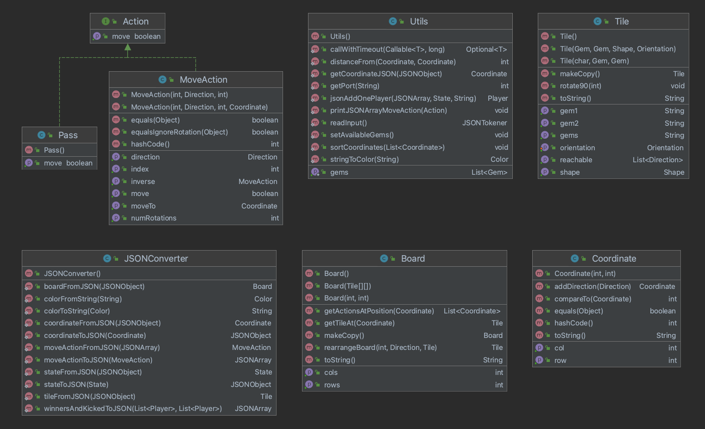
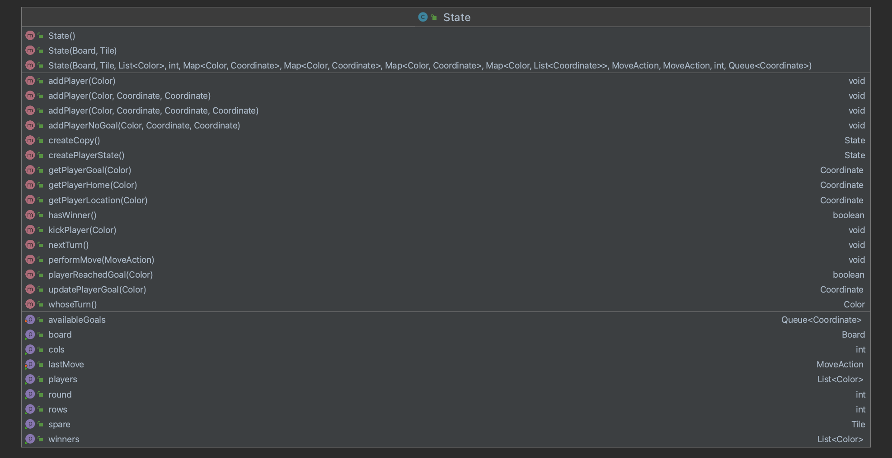

# Common

This directory holds all common files that are shared between Players and the Referee.

### Files/Directories in this directory:
| Name | Description |
| ---- | ----------- |
| [Action](Action.java) | Represents an action a player can take in the game (Pass or MoveAction). |
| [Board](Board.java) | The board of a Labyrinth game. It holds all information to do with the arrangement and manipulation of tiles. |
| [Coordinate](Coordinate.java) | Represents a Coordinate on the board in (row, column) order. |
| [JSONConverter](JSONConverter.java) | Class containing methods for converting intermediate data structures to and from JSON. |
| [MoveAction](MoveAction.java) | Stores information about a move action. |
| [Pass](Pass.java) | The pass action. |
| [State](State.java) | The information the Referee has on the game. |
| [Tile](Tile.java) | Represents the tile of the game Labyrinth. |
| [Utils](Utils.java) | Utility functions to be shared by classes across the project. |
| [gems/](gems) | Directory containing the gem images |

### File Overview

