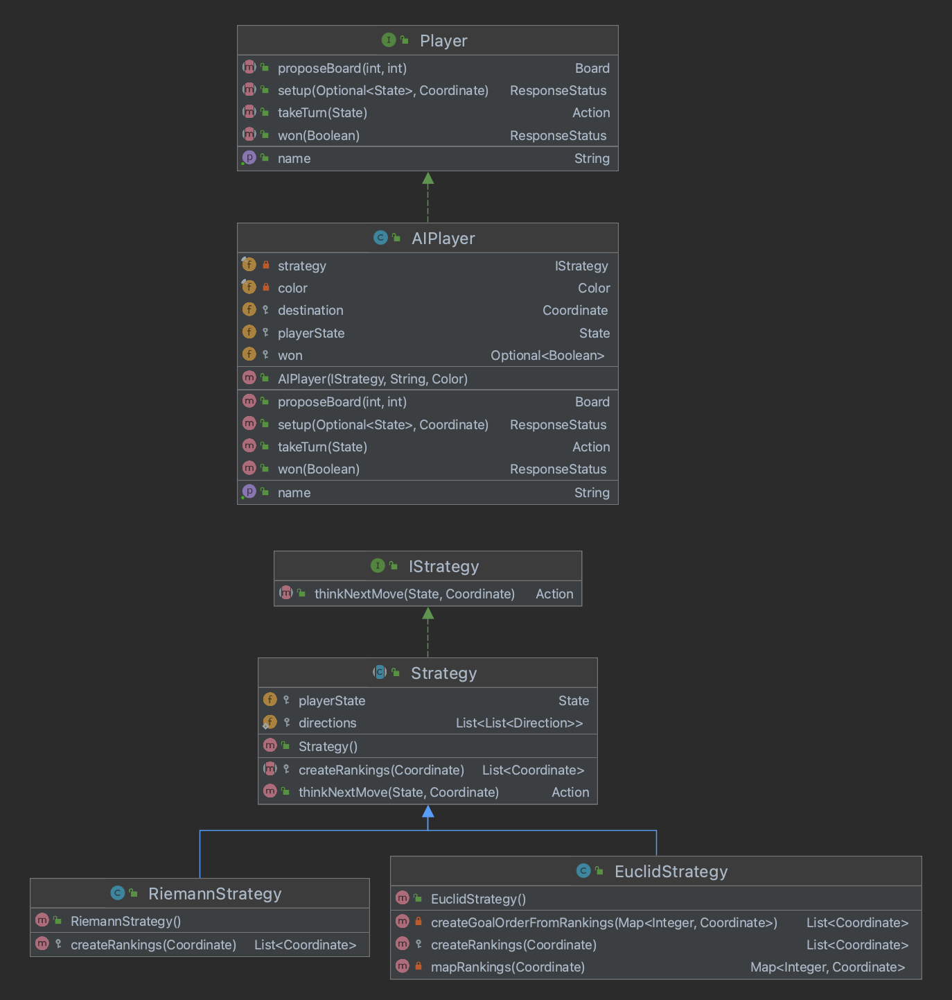

# Players

Contains the Strategies employed by players and a simple AI Player that uses a strategy to compute actions to take for a given state.
### Files/Directories in this directory:
| Name | Description |
| ---- | ----------- |
| [AIPlayer](AIPlayer.java) | Represents a computer player of the game that uses a particular strategy to play the game of Labyrinth. |
| [EuclidStrategy](EuclidStrategy.java) | EuclidStrategy is a strategy that prioritizes the goal, but when it can't be reached, prioritizes coordinates closest to the goal using euclidean distance (breaks ties by row-column order). |
| [IStrategy](IStrategy.java) | Represents a strategy for an AIPlayer to use. |
| [Player](Player.java) | Represents a player of the game of Labyrinth |
| [RiemannStrategy](RiemannStrategy.java) | RiemannStrategy is a strategy that prioritizes the goal, but when it can't be reached, prioritizes coordinates in row-column lexicographical order. |
| [Strategy](Strategy.java) | Strategy represents a strategy that can be used by an AIPlayer to play the game Labyrinth. The AIPlayer is given an Strategy in its constructor to use and should be the only use of Strategy |

### File Overview
