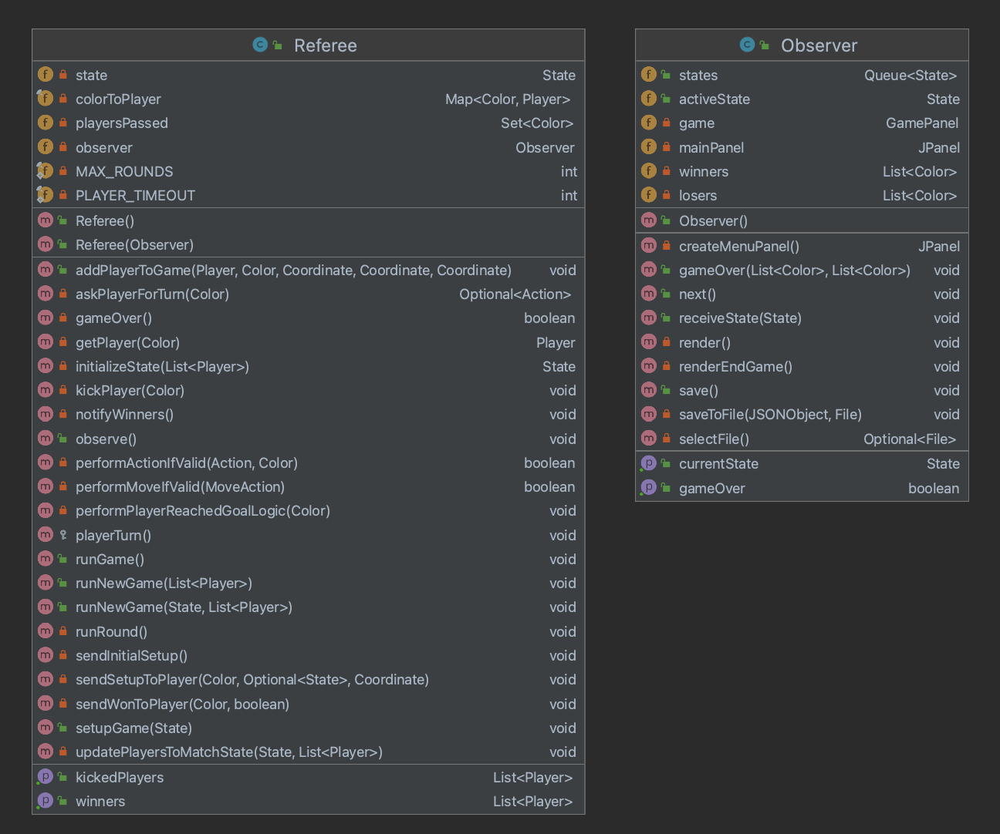
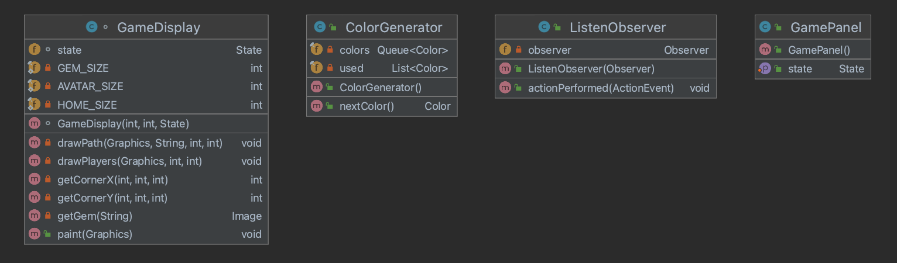

# Referee

This directory holds all files concerned with the Referee and Observer logic for the game.

### Files/Directories in this directory:
| Name | Description |
| ---- | ----------- |
| [ColorGenerator](ColorGenerator.java) | A class used to create random colors. Each color generated from a single ColorGenerator will be distinct from all previously produced colors. |
| [GameDisplay](GameDisplay.java) | The display view of the game. |
| [GamePanel](GamePanel.java) | Display of the game's state of Labyrinth. |
| [ListenObserver](ListenObsever.java) | An action listener to listen to the observer. |
| [Observer](Observer.java) | The Observer displays each state of a game of Labyrinth. |
| [Referee](Referee.java) | Given a List of Players (and optionally a State), the Referee runs an entire game from the initial state until the game is over. The winners and losers are computed and notified of their performance. The Referee also computes the players that were kicked during the game.  |

### File Overview

