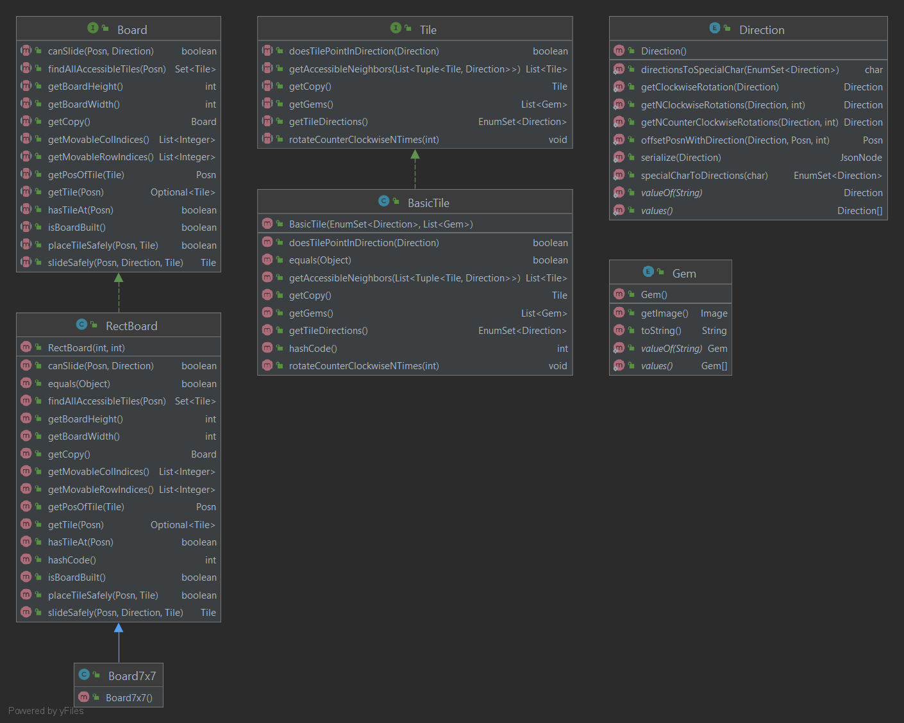

The Board
---

## Purpose

This directory contains the main logic required to represent the Board data structure.

Note: Other data definitions used not in this module are: [Posn](../../util/Posn.java),
[Tuple](../../util/Tuple.java), and [Direction](../../util/Direction.java)

## Contents

- [Board](Board.java)
    - [RectBoard](RectBoard.java)
        - [Board7x7](Board7x7.java)
- [Tile](Tile.java)
    - [BasicTile](BasicTile.java)
- [Gem](Gem.java)

### Diagram of Module Interactions


### File Descriptions

**Board:** An interface that represents a board for the game Labyrinth.

**RectBoard:** A rectangle board representation that can be any pair of dimensions.

**Board7x7:** An extension of the RectBoard class used for convenience to create a 7x7 board.

**Tile:** Represents a tile on the board in the game Labyrinth.

**BasicTile:** Represents a tile on the board of a game of Labyrinth.

**Gem:** The representation of a gem as part of a tile's treasure.

## Run the Board Test Harness

The Board Testing Harness can be found in the top-level directory [3](../../../../../../3).

The Board Harness specific tests are located in [3/tests](../../../../../../3/Tests)

To build the harness, run:
```sh
$ make
```

To run a specific test `n` with the harness, do:
```sh
$ cat Tests/n-in.json | ./xboard
```
