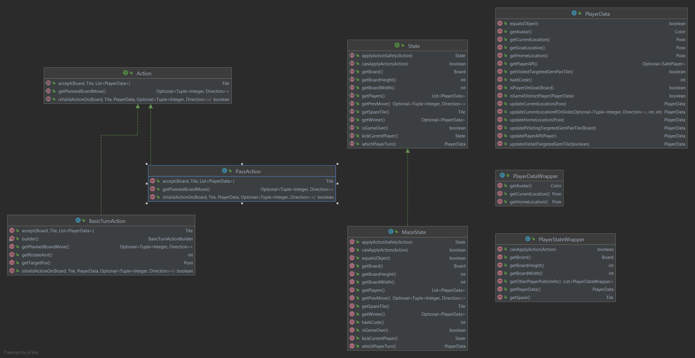

The State
---

## Purpose

This directory contains the main logic to keep track of the information for the game Labyrinth.

## Contents

- [State](State.java)
    - [MazeState](MazeState.java)
- [Action](Action.java)
    - [BasicTurnAction](BasicTurnAction.java)
    - [PassAction](PassAction.java)
- [PlayerData](PlayerData.java)
- [PlayerDataWrapper](PlayerDataWrapper.java)
- [PlayerStateWrapper](PlayerStateWrapper.java)

### Diagram of Module Interactions


### File Descriptions

**State:** An interface that represents the state of a game of Labyrinth

**MazeState:** A concrete implementation of the state of a game of Labyrinth

**Action:** An interface that represents a move that a player can make in the game Labyrinth. Contains methods for validating the move,
calculating the state upon execution of the move, and getting the planned sliding action if there is one.

**BasicTurnAction:** An action that represents optionally rotating a spare tile, sliding a row/column, and moving the player to a specific location.

**PassAction:** An action used by the player to represent a pass, does not change the board.

## Run the State Test Harness

The State Testing Harness can be found in the top-level directory [4](../../../../../../4).

The State Harness specific tests are located in [4/tests](../../../../../../4/Tests)

To build the harness, run:
```sh
$ make
```

To run a specific test `n` with the harness, do:
```sh
$ cat Tests/n-in.json | ./xstate
```
