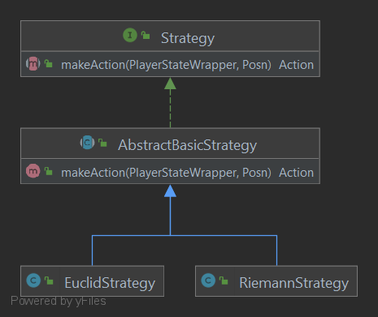

The Strategy
---

## Purpose

This directory contains the main logic required to represent a Strategy. A Strategy is given a 
state and computes an "appropriate" action for the current player to take. As of now, there are
two main implementations of the Strategy interface: Euclid and Riemann.

## Contents

- [Strategy](Strategy.java)
    - [AbstractBasicStrategy](AbstractBasicStrategy.java)
        - [EuclidStrategy](EuclidStrategy.java)
        - [RiemannStrategy](RiemannStrategy.java)

### Diagram of Module Interactions


### File Descriptions

**Strategy:** A Strategy computes an Action based on a given state and goal position.

**AbstractBasicStrategy:** Obtains a list of candidate positions to attempt to move to and
tries every possible [BasicTurnAction](../state/BasicTurnAction.java) with each candidate. This
strategy returns the first valid action the current player can take.

**EuclidStrategy:** Orders the candidates by their distance to the target Posn.

**RiemannStrategy:** Orders the candidates from left to right, top to bottom.

## Run the Strategy Test Harness

The Strategy Testing Harness can be found in the top-level directory [5](../../../../../../5).

The Harness specific tests are located in [5/tests](../../../../../../5/Tests)

To build the harness, run:
```sh
$ make
```

To run a specific test `n` with the harness, do:
```sh
$ cat Tests/n-in.json | ./xchoice
```
