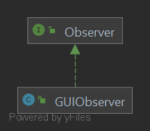

The Observer
---

## Purpose

This directory contains the main logic to observe a game of Labyrinth.

## Contents

- [Observer](Observer.java)
- [GUIObserver](GUIObserver.java)

### Diagram of Module Interactions

### File Descriptions

**Observer:** An interface that represents an observer of a game of Labyrinth. This observer has two functions, to be notified of 
a change in state, and to be notified of the end of the game. After the observer is notified of the end of the game it stops accepting
notifications of a change in state.

**GUIObserver:** A concrete implementation of an observer using Java Swing, utilizes classes in the [view module](../view). Contains two buttons:
one to view the next state, and one to save the state that is currently being viewed as a json file. 
