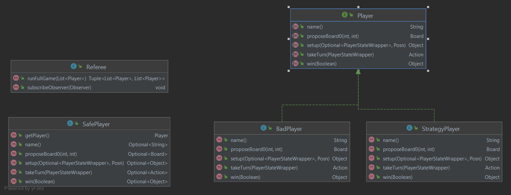

The Referee
---

## Purpose

This directory contains the main portion of the Referee logic. Given a list of Players, the Referee
sets up the game, runs the game to completion, notifies each player if they won the game, and then
returns a list of the players who won the game, and a list of players that were kicked from the game.

**Note:** A Player will be kicked from the game if the Player produces a malformed response. The Referee wraps
each Player with the [SafePlayer](SafePlayer.java) which ensures that all player responses are well-formed. 
If a Player does have a malformed/no response, then an empty Optional is returned from the SafePlayer.
This signifies to the Referee that the player gave a malformed response and must be kicked from the game.

## Contents

- [Referee](Referee.java)
- [Player](Player.java)
    - [BadPlayer](BadPlayer.java)
    - [StrategyPlayer](StrategyPlayer.java)
- [SafePlayer](SafePlayer.java)

### Diagram of Module Interactions


### File Descriptions

**Referee:** The Referee is in charge of running an entire game to completion.

**Player:** The Player API. All methods listed here can be called to inform a Player or to request
information from the Player.

**BadPlayer:** Represents a Player that throws an exception on a specified action.

**StrategyPlayer:** Represents a Player that chooses actions via a given strategy.

**SafePlayer:** This is a Player decorator that safely runs each method of the given player. If the 
given player throws an exception for any called method or the method takes too long to run, this SafePlayer will return an empty 
optional which signifies an invalid move as described by the Referee.

## Run the Referee Test Harness

The Referee Testing Harness can be found in the top-level directory [6](../../../../../../6).

The Referee Harness specific tests are located in [6/tests](../../../../../../6/Tests)

To build the harness, run:
```sh
$ make
```

To run a specific test `n` with the harness, do:
```sh
$ cat Tests/n-in.json | ./xgames
```
