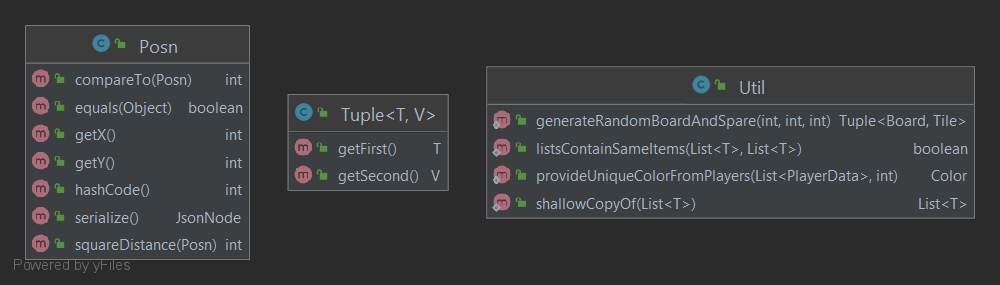

Util
---

## Purpose

This directory contains utility classes used to help the concrete implementations run the game Labyrinth.

## Contents

- [Direction](Direction.java)
- [Posn](Posn.java)
- [Tuple](Tuple.java)
- [Util](Util.java)

### Diagram of Module Interactions

### File Descriptions

**Direction:** Represents a direction of either: left, right, up, or down. Also includes convenience methods for handling different functions relating to directions
such as getting a direction that is a specific number of clockwise directions from another direction.

**Posn:** A position class used to represent a coordinate on the board. The `x` integer represents
the column and the `y` integer represents the row. This class is separate from the Tuple class as it
holds specific public methods used only with a Pair of integers in the context described here.

**Tuple:** A generic and immutable data structure that holds two items of any type.

**Util:** General utility methods that do not require an entire class are placed here.