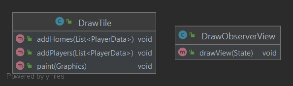

View
---

## Purpose

This directory contains utility classes used to draw a representation of the game Labyrinth.

## Contents

- [DrawObserverView](DrawObserverView.java)
- [DrawTile](DrawTile.java)

### Diagram of Module Interactions

### File Descriptions

**DrawObserverView:** This class is responsible for drawing the GUI component of the Obeserver.

**DrawTile:** Represents a special JPanel that draws the stored acceptable character with a border
at the edge of the JPanel. The Tile panel also draws all players and houses located at this tile
position.
